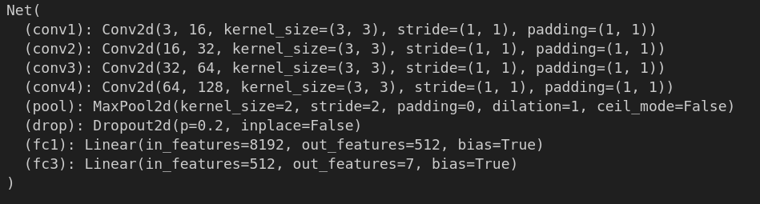
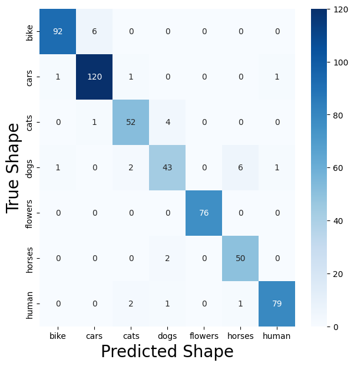
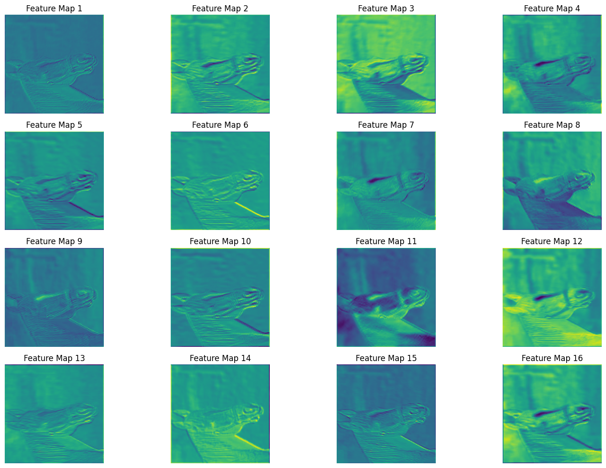
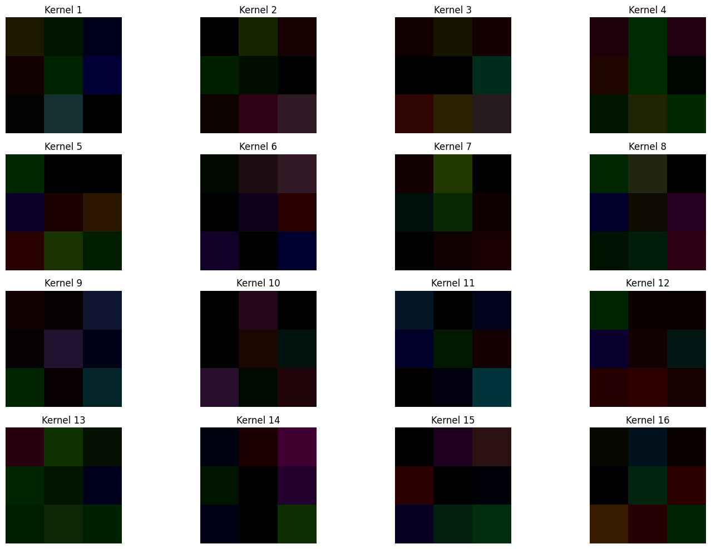
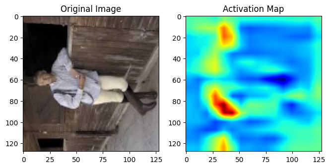

# Multiclass Object Classification: Custom CNN vs. CNN+SVM Models

## Overview
This repository contains a custom Convolutional Neural Network (CNN) model developed for multiclass object classification using images from a Kaggle dataset. The dataset comprises images belonging to different categories, including bikes, cars, cats, dogs, flowers, horses, and humans. 

## Dataset
The dataset consists of the following categories with corresponding number of files:
- Bike: 365 files
- Car: 420 files
- Cat: 202 files
- Dog: 202 files
- Flower: 210 files
- Horse: 202 files
- Human: 202 files

## Model Architecture
Both models consist of multiple convolutional layers followed by max pooling layers for feature extraction. The extracted features are then flattened and passed through fully connected layers before the final classification layer. Visual representations of the model architectures are provided below:

## Performance
The model's performance is evaluated using various metrics such as accuracy, precision, recall, and F1-score. Additionally, confusion matrices are generated to analyze the model's predictions across different classes.

### Custom Model:
- Accuracy: 95.0%
- Precision: 94.80%
- Recall: 94.63%
- F1 Score: 94.58%

### CNN+SVM Model:
- Accuracy: 86.85%
- Precision: 87.26%
- Recall: 86.85%
- F1 Score: 86.78%

### Comparison:
- The custom model outperforms the CNN+SVM model in terms of accuracy, precision, recall, and F1 score.
- The custom model achieved higher scores in all metrics, indicating superior performance on the evaluated task.
- Notably, the custom model demonstrated better capability in distinguishing between different classes, as reflected in higher precision, recall, and F1 score values across most classes.

## Feature Maps and Activation Maps
Feature maps and activation maps are visualized to provide insights into the learned features and the activation patterns within the network. Examples of feature maps and activation maps are included in the repository.

Feature map

Learned Kernal

Activation Map

## Usage
To use the model:
1. Clone the repository to your local machine.
2. Install the necessary dependencies (TensorFlow, Keras, etc.).
3. Preprocess the dataset and organize it into appropriate directories.
4. Train the model using the provided scripts or notebooks.
5. Evaluate the model's performance and fine-tune as needed.

## Contribution
Contributions to improve the model's performance or add new features are welcome. Please submit a pull request with a detailed description of the proposed changes.